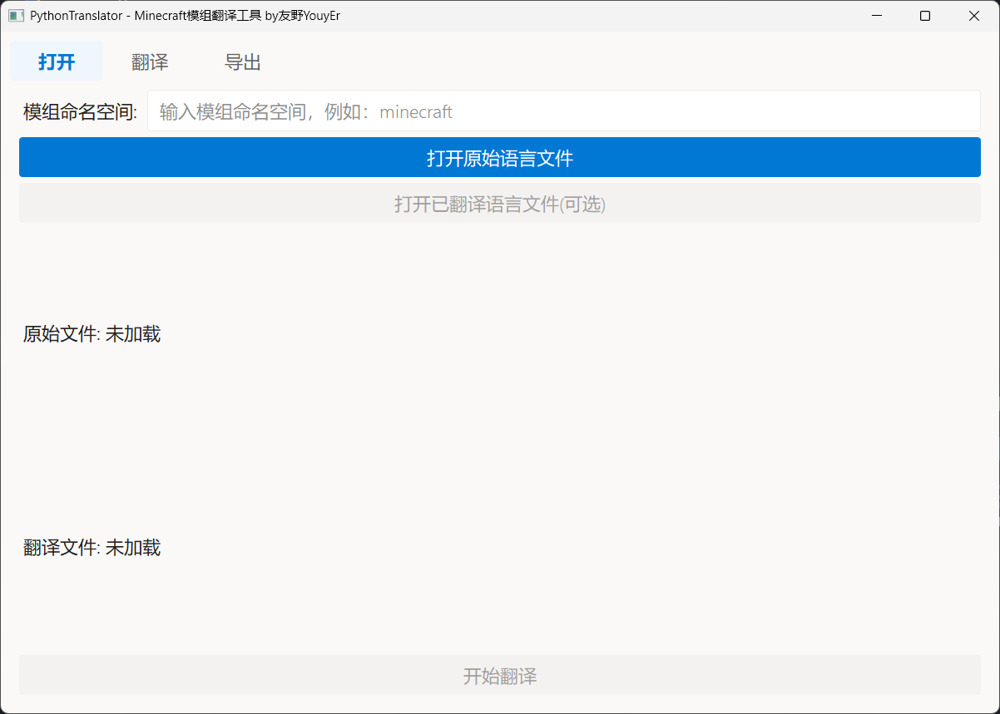

# Minecraft 模组翻译工具 (Python版)

  

这是一个使用Python和PyQt5开发的Minecraft模组翻译工具，提供简洁高效的翻译界面。支持.lang和.json两种格式的语言文件，帮助模组开发者快速完成本地化工作。

## 功能特性

- 🚀 **双格式支持**：同时支持.lang和.json格式的语言文件
- 🧠 **智能识别**：自动检测语言文件格式和版本
- 💾 **进度保存**：支持保存翻译进度并继续翻译
- 🎨 **直观界面**：提供简洁高效的翻译工作流
- ⚡ **批量操作**：支持批量处理翻译条目
- ⌨️ **快捷键优化**：提供高效的快捷键操作
- 🔍 **智能导航**：自动跳转到下一个未翻译条目
- 📦 **命名空间管理**：支持模组命名空间区分

## 界面预览



## 安装要求

1. Python 3.6+
2. PyQt5

```bash
pip install PyQt5
```

## 使用方法

### 基本使用

1. 运行程序:
```bash
python main.py
```

2. 使用步骤:
   - 输入模组命名空间（用于区分不同模组的翻译）
   - 打开原始语言文件（支持.lang和.json格式）
   - 可选择性地打开已有的翻译文件
   - 点击"开始翻译"进入翻译界面
   - 在翻译界面中完成翻译工作
   - 导出完成的翻译文件

### 文件结构

```
MinecraftTranslator/
├── core.py           # 核心功能模块
├── ui.py             # 用户界面模块
├── main.py           # 程序入口
├── icons/            # 图标资源
│   ├── check.png     # 已翻译图标
│   └── empty.png     # 未翻译图标
├── style.qss         # 界面样式表
└── README.md         # 项目文档
```

## 界面介绍

程序包含三个主要标签页:

1. **打开** - 用于加载文件
   - 模组命名空间输入框
   - 支持打开原始语言文件
   - 支持打开已有的翻译文件
   - 自动检测文件格式和版本

2. **翻译** - 提供翻译界面
   - 左侧是条目列表，显示翻译进度和状态图标
   - 右侧是翻译编辑区
   - 支持快捷键操作
   - 支持批量处理功能
   - 显示翻译进度统计

3. **导出** - 预览和保存翻译结果
   - 预览翻译结果
   - 保存为原始格式
   - 自动使用模组命名空间命名文件

## 快捷操作

- **Enter** - 保存当前翻译并跳转到下一个条目
- **Shift + Enter** - 在翻译文本中插入换行
- **上一个/下一个** - 在翻译条目间导航
- **跳过** - 跳到下一个未翻译条目
- **清除重复译文** - 删除与原文完全相同的译文
- **填充原文到译文** - 对未翻译条目用原文填充

## 文件格式支持

### JSON格式 (.json)
- 支持标准JSON格式
- 支持UTF-8编码
- 自动检测格式
- 适用于1.13+版本

### LANG格式 (.lang)
- 支持标准LANG格式
- 支持UTF-8编码
- 自动检测格式
- 适用于1.12.2版本

## 模组命名空间

- 用于区分不同模组的翻译
- 影响导出文件的命名
- 默认值为"mod"
- 建议使用模组的实际ID作为命名空间

## 开发与扩展

### 代码结构

```python
# core.py - 核心功能
class LangFormat(Enum): ...  # 文件格式枚举
class TextElement: ...      # 翻译条目类
class LangFileParser: ...   # 文件解析器
class ModDictionary: ...    # 模组字典管理

# ui.py - 用户界面
class TranslationItem(QWidget): ... # 单个翻译项UI
class MainWindow(QMainWindow): ...  # 主窗口

# main.py - 程序入口
if __name__ == "__main__": ...     # 启动应用
```

### 扩展方向

1. **添加翻译API集成**:
```python
# 在core.py中添加
class TranslationAPI:
    @staticmethod
    def translate(text, target_lang="zh-CN"):
        # 实现API调用
```

2. **添加更多文件格式支持**:
```python
# 在LangFormat枚举中添加
class LangFormat(Enum):
    JSON = "json"
    LANG = "lang"
    YAML = "yaml"
```

3. **添加主题切换功能**:
```python
# 在ui.py中添加
def setup_theme_switcher(self):
    # 实现主题切换
```

## 注意事项

- 程序会自动检测语言文件格式
- 建议定期保存翻译进度
- 支持中文界面和中文输入
- 支持大文件处理
- 翻译状态使用图标直观显示

## 贡献指南

欢迎贡献代码！请遵循以下步骤：

1. Fork 项目仓库
2. 创建特性分支 (`git checkout -b feature/your-feature`)
3. 提交更改 (`git commit -m 'Add some feature'`)
4. 推送到分支 (`git push origin feature/your-feature`)
5. 创建 Pull Request

## 许可证

本项目遵循 MIT 许可证 - 详情请参阅 [LICENSE](LICENSE) 文件。

## 致谢

本项目参考了以下开源项目：
- [Tryanks/WebTranslator](https://github.com/Tryanks/WebTranslator)

---

**Happy Translating!** 🎮📝